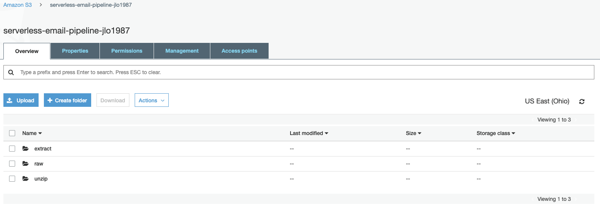

# AWS_Serverless_Pipeline

> Using AWS Cloud Services Lambda, S3, Glue and Athena, we are going to build a data pipeline written in Python and deploy it using the [Serverless Framework](https://www.serverless.com/).

### Why is this particular project important?

The purpose of this project was to learn to build out and process a tremendous amount of data without too much infrastructure configuration. Doing this will help simplify and accelerate the infrastructure provisioning process that will save time and money.

### What are we doing?

We are extracting contents from email messages (.eml). Starting from a .zip file that contains the email messages, an event in one folder of our S3 bucket will trigger a Lambda function to do some processing. The result of the Lambda function will be dumped in another folder in our S3 bucket, which will then trigger another Lambda function to do some processing. In total, this data pipeline has 3 processing steps: **unzip, extract and load,** utilizing Python and PySpark.

### The Serverless data pipeline design

S3 raw/ -> Lambda unzip -> Glue Job unzip -> S3 unzip -> Lambda extract -> S3 extract/ -> Lambda load -> Glue Crawler load -> Athena

### Step 1: Configure AWS

Create an admin User using the AWS IAM Management Console to set the credentials under a [serverless] section in the credentials file located in:

`/.aws/credentials` with the name `serverless`. By adding the credentials to the AWS credentials file, you can use any AWS command using the desired profile. It should look something like this:

`[serverless]
aws_access_key_id = 'enter_your_access_key_id'
aws_secret_access_key = 'enter_your_secret_access_key_id'`

### Step 2: Create the necessary roles with attached permissions policies

For this project, we will need two roles:
* One for [Lambda](https://docs.aws.amazon.com/lambda/latest/dg/lambda-intro-execution-role.html)
* One for [Glue](https://docs.aws.amazon.com/glue/latest/dg/create-an-iam-role.html)

After creating the roles, copy the [ARN](https://docs.aws.amazon.com/general/latest/gr/aws-arns-and-namespaces.html) and keep it somewhere acessible.

### Step 3: Configuring your local environment

Create a folder with the name of the project (you can use any name, but I named my folder _serverless_email_pipeline_:

`$ mkdir serverless_email_pipeline`

`$ serverless_email_pipeline`

Then we will want to export the serverless AWS profile we just created so that you use the correct credentials when we deploy the infrastructure. To make sure the AWS_PROFILE environment variable is set to `serverless`, execute the following statement:

`$ export AWS_PROFILE='serverless'`

Install the [AWS CLI](https://docs.aws.amazon.com/cli/latest/userguide/cli-chap-welcome.html):

`$ pip install awscli`

Install [Serverless](https://www.npmjs.com/package/serverless) via npm:

`$ sudo npm install -g serverless`

Install the Serverless plugin. This will allow all of the services at the end of the project to be removed:

`$ npm install serverless-s3-remover`

`$ serverless`

It will then prompt the following: `"Serverless: Would you like to setup a command line <tab> completion?"` Type 'No'.

### Step 4: Building the pipeline

Using the script in the [serverless.yml](https://github.com/jlo87/AWS_Serverless_Pipeline/blob/master/serverless.yml) file, we can configure the entire pipeline, allowing data to be stored/transmitted where we specify for certain variables and functions which we will use. This essentially allows "triggering" of the various jobs throughout the entirety of this project.

### Step 5: Unzip messages with a Lambda function

This function will simply trigger the Glue job that unzips the .zip file. As soon as a .zip file is dumped under the prefix raw/folder in our S3 bucket, the Lambda is triggered.

_So, who handles the creation of the bucket that triggers the Lambda function?_ The [Serverless Framework](https://www.serverless.com/)!

Run the [unzip.py](https://github.com/jlo87/AWS_Serverless_Pipeline/blob/master/lambda_function/unzip.py) script and save it under the lambda directory: `lambda/unzip.py`

### Step 6: Unzip messages with Glue job

The [serverless.yml](https://github.com/jlo87/AWS_Serverless_Pipeline/blob/master/serverless.yml) file from step 4 will also specify a [CloudFormation template](https://docs.aws.amazon.com/AWSCloudFormation/latest/UserGuide/template-guide.html) for the Glue job.

_The Serverless framework has no built-in support for the Glue service, but if the service is supported by CloudFormation, you can specify it in the serverless.yml file under the resource section._

Now we need to define the **BucketName** where the Glue script will be stored. Use the [unzip.py](https://github.com/jlo87/AWS_Serverless_Pipeline/blob/master/glue/unzip.py) script for unzipping and save it under the glue directory: `glue/unzip.py`

**Note:** You may get an `ImportError: No module named boto3`. In this case, you will need to install the library with: `$ pip install boto3`. Here is the link to the library in pypi: https://pypi.org/project/boto3/. This script will be committed to the Jobs section, under ETL of the Glue dashboard where you can run the code.

### Step 7: Extract messages from the Lambda function

After unzipping the email messages, you will need to extract the contents from the email. 

Run the [extract.py](https://github.com/jlo87/AWS_Serverless_Pipeline/blob/master/lambda_function/extract.py) script and save it under the lambda firectory: `lambda/extract.py`

The extract Lambda function is triggered when a file with extension .eml is created in the S3 bucket under the unzip/folder. The trigger for this Lambda is the output of the previous Glue job, which is triggered by the unzip Lmabda. The output of one processing task is dumped in the destination key, this destination key is the input of the next step in the pipeline.

### Step 8: Loading messages with the Lambda function

After the extract Lambda function from step 7 runs, a JSON object with the message contents is dumped in the S3 bucket, under the folder extract/. As soon as a JSON file is created under the extract/folder, the Lambda load function is triggered. The load Lambda triggers a [Glue Crawler](https://docs.aws.amazon.com/glue/latest/dg/console-crawlers.html) that will make the extrated data available in an [Athena](https://aws.amazon.com/athena/?whats-new-cards.sort-by=item.additionalFields.postDateTime&whats-new-cards.sort-order=desc) database.

Run the [load.py](https://github.com/jlo87/AWS_Serverless_Pipeline/blob/master/lambda_function/load.py) script to trigger the Glue Crawler and save it under the lambda directory: `lambda/load.py`

### Step 9: Loading messages with Glue Crawler

In order for extracted content to be available in a database, in this case, the Athena database, we will use a Glue Crawler. It 'crawls' through your S3 bucket and populates the [AWS Glue Data Catalog](https://docs.aws.amazon.com/glue/latest/dg/populate-data-catalog.html) with tables. We are then able to query this table via Athena!!

**Note:** If your data gets bigger, you may convert from a JSON format to a parquet file format to accommodate. Glue easily allows the process of converting from JSON to parquet.

### Step 10: Time to deploy and run the pipeline!

Before we deploy, download the email samples here by executing the following statement:

`$ wget -N -P samples https://serverless-data-pipeline-samples-dummy-emails.s3.eu-central-1.amazonaws.com/dummy_mails.zip`

Deploy the [serverless.yml](https://github.com/jlo87/AWS_Serverless_Pipeline/blob/master/serverless.yml) infrastructure where 'jlo1987' is my unique identifier on line 11 of the python script. You will need to choose one for yourself and then execute the following:

`$ sls deploy --stage jlo1987`

You will then see something similar to this:

`Serverless: Packaging service...
Serverless: Excluding development dependencies...
Serverless: Uploading CloudFormation file to S3...
Serverless: Uploading artifacts...
Serverless: Uploading service serverless-email-pipeline.zip file to S3 (101.29 KB)...
Serverless: Validating template...
Serverless: Updating Stack...
Serverless: Checking Stack update progress...
.....................
Serverless: Stack update finished...
Service Information
service: serverless-email-pipeline
stage: jlo1987
region: us-east-2
stack: serverless-email-pipeline-jlo1987
resources: 22
api keys:
  None
endpoints:
  None
functions:
  unzip: serverless-email-pipeline-jlo1987-unzip
  extract: serverless-email-pipeline-jlo1987-extract
  load: serverless-email-pipeline-jlo1987-load
layers:
  None
Serverless: Publishing service to the Serverless Dashboard...
Serverless: Successfully published your service to the Serverless Dashboard: https://dashboard.serverless.com/tenants/jonathanlo/applications/serverless-email-pipeline-app/services/serverless-email-pipeline/stage/jlo1987/region/us-east-2`

After successful deployment of the infrastructure, execute the following. This will place your Glue Scripts from step 6 into bucket _serverless-data-pipeline-'your-unique-identifier'-glue-scripts_:

`$ aws s3 cp glue/ s3://serverless-email-pipeline-jlo1987-glue-scripts/ --recursive`

Execute the following to copy the sample emails to the **raw** key of the S3 bucket _serverless-data-pipeline-'your-unique-identifier'_ to trigger the execution of the data pipeline:

`$ aws s3 cp samples/ s3://serverless-email-pipeline-jlo1987/raw/ --recursive`

### At this point, investigate the data pipeline execution to verify successful completion

**S3**: In the `s3://serverless-email-pipeline-jlo1987/` bucket, you will gradually see the following folders appear:

**Glue**: You can check the Glue jobs by going to the Jobs section of the left-hand side. When you select your Glue job, you can see if the Glue job succeeded or not:

### Step 11: Exploring the data with Athena

To explore the data, go the the Athena console, select your database, which is called _serverless-data-pipeline-'your-unique-identifier'._ 

Before running your first query, you need to set up a query result location in S3:

After setting up a query result location, you should see the table messages_extract if you execute the following statement in the query editor:

`SELECT * FROM "serverless-data-pipeline-jlo1987"."messages_extract";`

